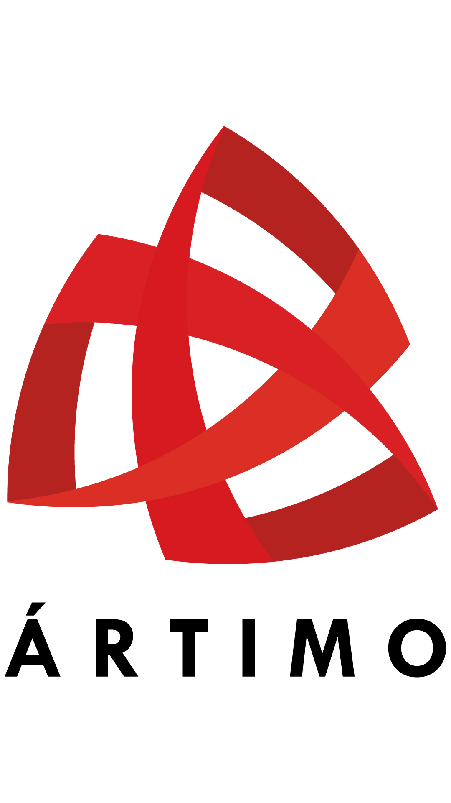

# 🎨 Manual de Identidad de Marca — ÁRTIMO
> Basado en el Manual de Identidad Visual ÁRTIMO 2018  
> **Referencia obligatoria** al diseñar cualquier HTML, presentación, componente o pieza visual relacionada con ÁRTIMO.

---

## 📌 Filosofía de Marca

ÁRTIMO nace como solución de productividad para optimizar la operación de equipos móviles. Su identidad visual se construye sobre los siguientes conceptos clave:

- **Dinamismo · Conexión · Tecnología**
- **Ciclo · Fuerza · Modernidad · Impacto**

El símbolo se construye a partir de la modulación y rotación de un mismo círculo. Las contraformas, colores planos y ángulos generan un carácter fuerte y moderno. Las uniones e inclinaciones otorgan movimiento, ritmo y continuidad. La forma triangular predominante comunica ascendencia y desarrollo.

---

## 🖼️ Logo

### Archivo oficial
El logo de ÁRTIMO **siempre** se referenciará con el siguiente nombre de archivo:

```
artimo_logo.jpg
```

> Este nombre es fijo en todos los repositorios. No renombrar. No usar versiones alternativas sin autorización.

### Uso en HTML
```html

```

### Versiones permitidas

| Versión | Uso recomendado |
|---|---|
| **Color** (principal) | Fondos blancos y claros |
| **Escala de grises** | Fondos neutros, junto a otras marcas (dealers) |
| **Positivo / Negativo** | Según contraste del fondo |
| **Sobre negro** | Fondos oscuros |
| **Sobre rojo** | Fondos en color corporativo rojo |
| **Sobre texturas** | Usar la versión que garantice legibilidad |
| **Solo símbolo** | Únicamente como **favicon** en pestaña del navegador |

### Espacio de respeto (Zona de exclusión)
`X` = altura de la tipografía "ÁRTIMO" en el identificador.

- **Versión vertical:** dejar `2X` a cada lado
- **Versión horizontal:** dejar `1X` a cada lado

### Tamaños mínimos

| Versión | Impreso | Web |
|---|---|---|
| Vertical | **15 mm** de ancho | **29 px** de ancho |
| Horizontal | **20 mm** de ancho | **67 px** de ancho |

---

## 🎨 Paleta de Colores Corporativa

### Colores Primarios del Identificador

| Nombre | Pantone | HEX | RGB | CMYK |
|---|---|---|---|---|
| Rojo Oscuro | PANTONE 7621 C | `#BC1818` | R.188 G.24 B.24 | C.18 M.100 Y.98 K.8 |
| Rojo Vivo | PANTONE 185 C | `#E10B17` | R.225 G.11 B.23 | C.0 M.100 Y.96 K.0 |
| Rojo Medio | PANTONE 485 C | `#E42520` | R.228 G.37 B.32 | C.0 M.94 Y.91 K.0 |
| Rojo Naranja | PANTONE 179 C | `#E63B1E` | R.230 G.59 B.30 | C.0 M.87 Y.92 K.0 |
| Gris Corporativo | PANTONE Cool Gray 11 | `#5A5A59` | R.90 G.90 B.89 | C.0 M.0 Y.0 K.80 |

> ⚠️ **Los rojos son la esencia visual de ÁRTIMO.** Toda pieza debe respetar esta gama. No usar rojos fuera de estos valores ni colores completamente distintos.

### Variables CSS recomendadas

```css
:root {
  /* Colores corporativos ÁRTIMO */
  --artimo-rojo-oscuro:   #BC1818;  /* Pantone 7621 C — principal */
  --artimo-rojo-vivo:     #E10B17;  /* Pantone 185 C */
  --artimo-rojo-medio:    #E42520;  /* Pantone 485 C */
  --artimo-rojo-naranja:  #E63B1E;  /* Pantone 179 C */
  --artimo-gris:          #5A5A59;  /* Pantone Cool Gray 11 */

  /* Neutros de apoyo */
  --artimo-negro:         #1A1A1A;
  --artimo-blanco:        #FFFFFF;
  --artimo-gris-claro:    #F2F2F2;
}
```

---

## 🗂️ Colores por Módulo de Producto

ÁRTIMO tiene una gráfica complementaria con colores asignados a cada módulo de su plataforma:

| Módulo | Pantone | HEX | RGB | CMYK |
|---|---|---|---|---|
| **Business Intelligence** | PANTONE 152 C | `#ED720E` | R.211 G.114 B.33 | C.0 M.65 Y.98 K.0 |
| **Operación** | PANTONE 1665 C | `#E74615` | R.201 G.72 B.31 | C.0 M.83 Y.98 K.0 |
| **Seguridad** | PANTONE 186 C | `#C20C16` | R.166 G.20 B.28 | C.0 M.100 Y.94 K.19 |
| **Logística** | PANTONE 7626 C | `#C23921` | R.168 G.60 B.40 | C.0 M.85 Y.86 K.21 |
| **Mantenimiento** | PANTONE 7625 C | `#EA5A3D` | R.206 G.90 B.65 | C.0 M.76 Y.76 K.0 |

### Variables CSS para módulos

```css
:root {
  --artimo-mod-bi:           #ED720E;  /* Business Intelligence */
  --artimo-mod-operacion:    #E74615;  /* Operación */
  --artimo-mod-seguridad:    #C20C16;  /* Seguridad */
  --artimo-mod-logistica:    #C23921;  /* Logística */
  --artimo-mod-mantenimiento:#EA5A3D;  /* Mantenimiento */
}
```

---

## 🔤 Tipografía

### Fuente principal: **Open Sans**

Aplicable tanto en impreso como en web. Se usan tres pesos:

| Peso | Uso recomendado |
|---|---|
| `Open Sans Light (300)` | Textos largos, cuerpo de texto, subtítulos |
| `Open Sans SemiBold (600)` | Títulos secundarios, etiquetas, énfasis medio |
| `Open Sans Bold (700)` | Títulos principales, CTAs, encabezados |

### Fuente segura (fallback web): **Arial**

### Importar en HTML/CSS

```html
<!-- Google Fonts - importar en el <head> -->
<link rel="preconnect" href="https://fonts.googleapis.com">
<link rel="preconnect" href="https://fonts.gstatic.com" crossorigin>
<link href="https://fonts.googleapis.com/css2?family=Open+Sans:wght@300;600;700&display=swap" rel="stylesheet">
```

```css
body {
  font-family: 'Open Sans', Arial, sans-serif;
  font-weight: 300; /* Light por defecto */
}

h1, h2, h3 {
  font-weight: 700; /* Bold para titulares */
}

label, .badge, .tag {
  font-weight: 600; /* SemiBold para etiquetas */
}
```

---

## 🧩 Gráfica Complementaria

- Nace de la **modulación de círculos** del identificador, dispuestos en trama.
- Refuerza los conceptos de movimiento, ciclo y conexión.
- Se emplea sobre fotografía intervenida (en escala de grises) o sobre color sólido.
- Los colores de los módulos del producto forman parte de esta gráfica.

---

## 📷 Manejo Fotográfico

- Las fotografías **siempre deben usarse en escala de grises** cuando aparezcan junto al identificador.
- **Prohibido** usar fotografías a color como fondo directo del logo.
- La legibilidad del identificador no debe comprometerse en ningún caso.

```css
/* Cuando se combine foto con el logo ÁRTIMO */
.artimo-photo-bg {
  filter: grayscale(100%);
}
```

---

## ❌ Usos Incorrectos — Prohibiciones Estrictas

Las siguientes prácticas están **terminantemente prohibidas**:

| ❌ Prohibición |
|---|
| Separar el símbolo del texto (o viceversa) — excepción: favicon |
| Deformar el símbolo o cambiar sus proporciones |
| Usar colores distintos a los establecidos en este manual |
| Usar fotografías a color de fondo |
| Violar el espacio de respeto (zona de exclusión) |
| Usar solo secciones del identificador |
| Aplicar fondos de color distintos a los autorizados |
| Cambiar la tipografía del identificador |
| Rotar, inclinar o distorsionar el logo |
| Agregar sombras, degradados o efectos no oficiales |

---

## ✅ Fondos Autorizados para el Logo

| Fondo | Versión a usar |
|---|---|
| Blanco / Claro | Logo a color |
| Negro / Oscuro | Logo sobre negro (versión especial) |
| Rojo corporativo | Logo sobre rojo (versión especial) |
| Textura | Versión que garantice mayor legibilidad |
| Junto a otras marcas | Escala de grises, versión horizontal |

---

## 💻 Guía Rápida para Desarrollo HTML

Al crear cualquier pieza HTML/web de ÁRTIMO, seguir este checklist:

```html
<!DOCTYPE html>
<html lang="es">
<head>
  <meta charset="UTF-8">
  <meta name="viewport" content="width=device-width, initial-scale=1.0">

  <!-- Tipografía corporativa ÁRTIMO -->
  <link href="https://fonts.googleapis.com/css2?family=Open+Sans:wght@300;600;700&display=swap" rel="stylesheet">

  <style>
    :root {
      /* Paleta ÁRTIMO */
      --artimo-rojo-oscuro:    #BC1818;
      --artimo-rojo-vivo:      #E10B17;
      --artimo-rojo-medio:     #E42520;
      --artimo-rojo-naranja:   #E63B1E;
      --artimo-gris:           #5A5A59;
      --artimo-negro:          #1A1A1A;
      --artimo-blanco:         #FFFFFF;
      --artimo-gris-claro:     #F2F2F2;

      /* Módulos */
      --artimo-mod-bi:            #ED720E;
      --artimo-mod-operacion:     #E74615;
      --artimo-mod-seguridad:     #C20C16;
      --artimo-mod-logistica:     #C23921;
      --artimo-mod-mantenimiento: #EA5A3D;
    }

    body {
      font-family: 'Open Sans', Arial, sans-serif;
      font-weight: 300;
      color: var(--artimo-negro);
      background-color: var(--artimo-blanco);
    }
  </style>
</head>
<body>
  <!-- Logo siempre con nombre fijo -->
  
</body>
</html>
```

### Checklist de cumplimiento de marca ✅

- [ ] Logo usa el archivo `artimo_logo.jpg`
- [ ] Logo respeta el espacio de exclusión (2X vertical / 1X horizontal)
- [ ] Logo no aparece en tamaño menor a 29px (web) o 15mm (impreso)
- [ ] Colores usados pertenecen a la paleta oficial
- [ ] Tipografía es Open Sans (o Arial como fallback)
- [ ] Fotografías de fondo están en escala de grises
- [ ] El símbolo y el texto del logo no están separados (salvo favicon)
- [ ] No se aplican efectos, sombras ni distorsiones al logo

---

## 💡 Patrones de UI — Dashboards ÁRTIMO

Esta sección documenta los componentes visuales reutilizables usados en los dashboards operativos. Seguir estos patrones garantiza consistencia entre todos los proyectos.

---

### Estructura base del HTML

```html
<!DOCTYPE html>
<html lang="es">
<head>
  <meta charset="UTF-8" />
  <meta name="viewport" content="width=device-width, initial-scale=1.0" />
  <title>[Cliente] — [Módulo] Dashboard</title>
  <!-- Tipografía corporativa -->
  <link href="https://fonts.googleapis.com/css2?family=Open+Sans:wght@300;600;700&display=swap" rel="stylesheet" />
  <style>
    /* Variables y CSS inline — sin build tools */
  </style>
</head>
<body>
  <div id="login-screen">...</div>
  <div id="app" style="display:none">
    <div class="topbar">...</div>
    <div class="main-content">...</div>
  </div>
</body>
</html>
```

> Los dashboards son **single-file HTML** (sin React, sin Webpack). CSS inline en `<style>`, JS al final del `<body>`. Se despliegan en GitHub Pages o Vercel sin proceso de build.

---

### Layout General

```css
body {
  font-family: 'Open Sans', Arial, sans-serif;
  font-weight: 300;
  background: #F4F5F7;   /* fondo general — gris muy claro */
  color: #1A1A1A;
}

.main-content {
  max-width: 1400px;
  margin: 0 auto;
  padding: 24px;
}
```

---

### Login Screen

Pantalla de acceso a pantalla completa con gradiente oscuro y tarjeta blanca centrada.

```css
#login-screen {
  position: fixed; inset: 0;
  background: linear-gradient(135deg, #1A1A1A 0%, #3a0808 50%, #BC1818 100%);
  display: flex; align-items: center; justify-content: center; z-index: 1000;
}
.login-card {
  background: #fff;
  border-radius: 16px;
  padding: 48px 40px;
  width: 360px;
  box-shadow: 0 24px 64px rgba(0,0,0,0.4);
  text-align: center;
}
.btn-login {
  width: 100%; padding: 13px;
  background: #BC1818; color: #fff;
  border: none; border-radius: 8px;
  font-size: 15px; font-weight: 600;
}
.btn-login:hover { background: #9a1414; }
input:focus { border-color: #BC1818; }
```

**Estructura HTML:**
```html
<div id="login-screen">
  <div class="login-card">
    <div class="login-logo"></div>
    <h2>[Nombre del cliente]</h2>
    <p>[Módulo] · Ártimo Telematics</p>
    <input type="text" placeholder="Usuario" />
    <input type="password" placeholder="Contraseña" />
    <button class="btn-login">Ingresar</button>
  </div>
</div>
```

---

### Topbar

Barra superior oscura fija (`sticky`). Logo a la izquierda, controles a la derecha.

```css
.topbar {
  background: #1A1A1A; color: #fff;
  height: 56px;
  display: flex; align-items: center; justify-content: space-between;
  padding: 0 24px;
  position: sticky; top: 0; z-index: 100;
  box-shadow: 0 2px 8px rgba(0,0,0,0.3);
}
.topbar-title { font-size: 18px; font-weight: 600; letter-spacing: 0.5px; }
.topbar-sub   { font-size: 11px; color: #9CA3AF; font-weight: 300; }
.topbar-date  { font-size: 12px; color: #9CA3AF; }
.btn-logout {
  background: none; border: 1px solid #4B5563; color: #9CA3AF;
  padding: 5px 12px; border-radius: 6px; cursor: pointer; font-size: 12px;
}
.btn-logout:hover { border-color: #BC1818; color: #fff; }
```

```html
<div class="topbar">
  <div class="topbar-brand">
    
    <div>
      <div class="topbar-title">[Cliente] · [Módulo]</div>
      <div class="topbar-sub">Ártimo Telematics</div>
    </div>
  </div>
  <div class="topbar-right">
    <span class="topbar-date" id="topbar-date">—</span>
    <button class="btn-logout">Salir</button>
  </div>
</div>
```

---

### Cards (contenedores generales)

```css
/* Card base */
.card {
  background: #FFFFFF;
  border-radius: 12px;
  padding: 20px;
  box-shadow: 0 2px 8px rgba(0,0,0,0.08);
  border: 1px solid #E5E7EB;
}

/* Card con acento de prioridad en el borde superior */
.card.prio-1 { border-top: 3px solid #BC1818; }
.card.prio-2 { border-top: 3px solid #E42520; }
.card.prio-3 { border-top: 3px solid #F59E0B; }
.card.prio-4 { border-top: 3px solid #5A5A59; }

/* Hover en cards clicables */
.card:hover {
  transform: translateY(-2px);
  box-shadow: 0 6px 18px rgba(0,0,0,0.13);
  transition: transform 0.15s, box-shadow 0.15s;
}
```

---

### KPI Cards

Grid de métricas principales. Valor numérico grande con color semántico.

```css
.kpi-grid {
  display: grid;
  grid-template-columns: repeat(auto-fit, minmax(165px, 1fr));
  gap: 16px;
  margin-bottom: 24px;
}
.kpi-card {
  background: #FFFFFF; border-radius: 12px; padding: 20px;
  box-shadow: 0 2px 8px rgba(0,0,0,0.08); border: 1px solid #E5E7EB;
  display: flex; flex-direction: column; gap: 6px;
}
.kpi-label { font-size: 11px; color: #5A5A59; text-transform: uppercase; letter-spacing: 0.5px; font-weight: 600; }
.kpi-value { font-size: 38px; font-weight: 700; line-height: 1; }
.kpi-sub   { font-size: 11px; color: #5A5A59; font-weight: 300; }

/* Color del valor según prioridad o estado */
.kpi-p1 .kpi-value { color: #BC1818; }
.kpi-p2 .kpi-value { color: #E42520; }
.kpi-p3 .kpi-value { color: #F59E0B; }
.kpi-dark .kpi-value { color: #1A1A1A; }
```

```html
<div class="kpi-grid">
  <div class="kpi-card kpi-p1">
    <div class="kpi-label">Crítico</div>
    <div class="kpi-value">12</div>
    <div class="kpi-sub">vehículos afectados</div>
  </div>
</div>
```

---

### Badges / Pills

Etiquetas de estado con fondo semitransparente y borde del mismo tono. No usar colores sólidos en badges.

```css
/* Patrón: fondo rgba + borde rgba del mismo color */
.badge-p1 { background: rgba(188,24,24,0.15);  color: #BC1818; border: 1px solid rgba(188,24,24,0.3);  padding: 2px 9px; border-radius: 12px; font-size: 11px; font-weight: 600; }
.badge-p2 { background: rgba(228,37,32,0.12);  color: #E42520; border: 1px solid rgba(228,37,32,0.3);  padding: 2px 9px; border-radius: 12px; font-size: 11px; font-weight: 600; }
.badge-p3 { background: rgba(245,158,11,0.12); color: #F59E0B; border: 1px solid rgba(245,158,11,0.3); padding: 2px 9px; border-radius: 12px; font-size: 11px; font-weight: 600; }
.badge-ok { background: rgba(16,185,129,0.2);  color: #10B981; border: 1px solid rgba(16,185,129,0.3); padding: 2px 9px; border-radius: 12px; font-size: 11px; font-weight: 600; }
.badge-mid { background: rgba(90,90,89,0.1);   color: #5A5A59; border: 1px solid rgba(90,90,89,0.2);  padding: 2px 9px; border-radius: 12px; font-size: 11px; font-weight: 600; }
```

**Niveles de alerta en topbar:**
```css
.badge-NORMAL     { background: rgba(16,185,129,0.2);  color: #10B981; }
.badge-PRECAUCION { background: rgba(245,158,11,0.2);  color: #F59E0B; }
.badge-CRITICO    { background: rgba(188,24,24,0.3);   color: #ff8080; }
```

---

### Tabs (navegación por pestañas)

```css
.tabs-section {
  background: #FFFFFF; border-radius: 12px;
  box-shadow: 0 2px 8px rgba(0,0,0,0.08); border: 1px solid #E5E7EB;
  overflow: hidden;
}
.tabs-header {
  display: flex; overflow-x: auto; border-bottom: 1px solid #E5E7EB;
  padding: 0 4px; background: #FAFAFA;
}
.tab-btn {
  padding: 12px 18px; border: none; background: none; cursor: pointer;
  font-size: 13px; font-weight: 300; color: #5A5A59;
  white-space: nowrap;
  border-bottom: 2px solid transparent; margin-bottom: -1px;
  transition: all 0.15s;
}
.tab-btn:hover  { color: #1A1A1A; }
.tab-btn.active { color: #BC1818; border-bottom-color: #BC1818; font-weight: 600; }
.tab-content { display: none; padding: 20px; }
.tab-content.active { display: block; }
```

---

### Tablas de datos

```css
.table-section {
  background: #FFFFFF; border-radius: 12px;
  box-shadow: 0 2px 8px rgba(0,0,0,0.08); border: 1px solid #E5E7EB;
  overflow: hidden;
}
.fc-table { width: 100%; border-collapse: collapse; font-size: 13px; }
.fc-table th {
  background: #F9FAFB; padding: 10px 14px;
  font-size: 11px; text-transform: uppercase; letter-spacing: 0.4px;
  color: #5A5A59; font-weight: 600; text-align: left;
}
.fc-table td { padding: 10px 14px; border-bottom: 1px solid #F3F4F6; font-weight: 300; }
.fc-table tr:hover td { background: #FAFAFA; }

/* Tint de fila por prioridad */
.fc-table tr.row-p1 td { background: rgba(188,24,24,0.03); }
.fc-table tr.row-p2 td { background: rgba(228,37,32,0.02); }
.fc-table tr.row-p1:hover td { background: rgba(188,24,24,0.06); }
.fc-table tr.row-p2:hover td { background: rgba(228,37,32,0.05); }
```

---

### Modal / Detalle

```css
.modal-overlay {
  position: fixed; inset: 0; background: rgba(0,0,0,0.5); z-index: 200;
  display: none; align-items: center; justify-content: center; padding: 20px;
}
.modal-overlay.open { display: flex; }
.modal-box {
  background: #fff; border-radius: 16px; width: 100%; max-width: 720px;
  max-height: 88vh; overflow-y: auto;
  box-shadow: 0 24px 64px rgba(0,0,0,0.3);
}
.modal-header {
  padding: 20px 24px; border-bottom: 1px solid #E5E7EB;
  display: flex; align-items: center; justify-content: space-between;
  position: sticky; top: 0; background: #fff;
}
.modal-body { padding: 24px; }

/* Items de detalle con borde izquierdo de color */
.detail-row { padding: 12px; border-radius: 8px; border-left: 4px solid #E5E7EB; }
.detail-row.p1 { border-left-color: #BC1818; background: rgba(188,24,24,0.04); }
.detail-row.p2 { border-left-color: #E42520; background: rgba(228,37,32,0.03); }
.detail-row.p3 { border-left-color: #F59E0B; background: rgba(245,158,11,0.03); }
```

---

### Inputs y controles de búsqueda/filtro

```css
.search-input, .filter-select {
  padding: 8px 12px;
  border: 1.5px solid #E5E7EB; border-radius: 8px;
  font-size: 13px; font-family: 'Open Sans', Arial, sans-serif; font-weight: 300;
  outline: none; transition: border-color 0.2s;
}
.search-input:focus,
.filter-select:focus { border-color: #BC1818; }
```

---

### Botones de selección (Day Picker / Toggle)

```css
.day-btn {
  padding: 8px 15px;
  background: #BC1818; color: #fff;
  border: 2px solid transparent; border-radius: 6px;
  font-size: 13px; font-weight: 700;
  transition: all 0.15s;
}
.day-btn:hover  { background: #9a1414; }
.day-btn.active { background: #1A1A1A; border-color: #1A1A1A; }
```

---

### Sección de título (Section Header)

```css
.section-title {
  font-size: 18px; font-weight: 700;
  margin-bottom: 16px; color: #1A1A1A;
  display: flex; align-items: center; gap: 8px;
}
.section-title span { font-size: 13px; font-weight: 300; color: #5A5A59; }
```

```html
<div class="section-title">
  Vehículos Críticos
  <span>· 12 unidades</span>
</div>
```

---

### Empty State

```css
.empty-state { padding: 48px; text-align: center; color: #5A5A59; }
.empty-state .icon { font-size: 48px; margin-bottom: 12px; }
```

```html
<div class="empty-state">
  <div class="icon">✅</div>
  <p>Sin alertas activas</p>
</div>
```

---

### Footer

```css
.footer {
  text-align: center; padding: 20px;
  font-size: 12px; color: #5A5A59; font-weight: 300;
}
```

---

### Resumen de valores constantes

| Token | Valor | Uso |
|---|---|---|
| `border-radius` card | `12px` | Cards, modales, paneles |
| `border-radius` botón | `8px` | Botones, inputs |
| `border-radius` badge | `12px` | Pills/etiquetas |
| `box-shadow` card | `0 2px 8px rgba(0,0,0,0.08)` | Elevación base |
| `box-shadow` modal | `0 24px 64px rgba(0,0,0,0.3)` | Modales flotantes |
| `border` card | `1px solid #E5E7EB` | Todos los contenedores |
| `font-size` label | `11px` uppercase + `letter-spacing: 0.5px` | Etiquetas de campo |
| `font-size` badge | `11px` | Todos los badges |
| `font-size` tabla | `13px` | Tablas y listas |
| `font-size` KPI | `38px` bold | Valor principal de métrica |
| `topbar height` | `56px` | Barra superior fija |
| `max-width` contenido | `1400px` | Contenedor principal |
| Fondo general | `#F4F5F7` | `body` background |
| Fondo card | `#FFFFFF` | Todos los contenedores |
| Fondo tabla header | `#F9FAFB` | `<th>` |
| Fondo hover fila | `#FAFAFA` | `tr:hover` |

---

## 📎 Referencias

| Recurso | Archivo |
|---|---|
| Manual de identidad original | `Manual de identidad Áritmo-2018.pdf` |
| Logo oficial | `artimo_logo.jpg` |
| Este documento | `ARTIMO_BRAND.md` |

---

*Documento generado a partir del Manual de Identidad Visual ÁRTIMO 2018. Toda pieza de comunicación debe respetar estrictamente estas especificaciones.*
